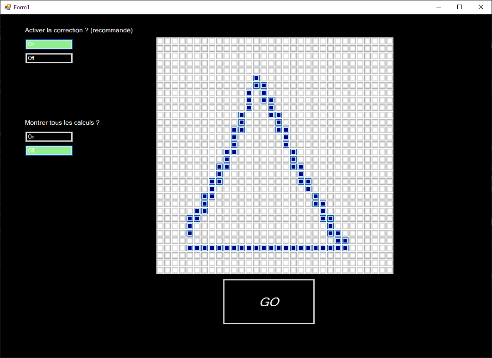
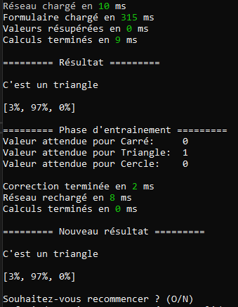

# ✨ AI - Patern Recognizer ✨

> Le but principal du projet est de dévellopper une IA simple capable de reconnaitre une forme telle qu'un carré, un cercle ou un triangle. Je profiterais de ce projet pour me familiariser avec la manière de "penser" de l'IA et ainsi en apprendre plus sur son fonctionnement.

## Structure du repo 📁

> Dans le repo, vous trouverez :
>
> 1.  Le dossier App_IA 
>     Il s'agit de l'application et de tout ce qui est utile pour faire fonctionner le programme, télécharger ce dossier suffit si vous souhaitez faire fonctionner l'IA
> 2.  Le dossier doc 
>     Dedans se trouvent les 2 version de Cahier des Charger (docx et pdf), ainsi que mon journal de travail (ouvrable avec l'application GitJournal) et enfin un dossier contenant les images figurant dans ce ReadMe.
> 3.  Le dossier IA03 
>     Il s'agit de la 3e version du programme, les 2 précédentes ne sont pas disponibles ici. Ce dossier contient la solution Visual Studio du programme.
> 4.  Les fichiers .git (.gitignore et .gitattributes)
> 5.  Un script python generate_last_layer.py
>     Il s'agit d'un script qui permet de générer la dernière couche du réseau en appliquant la notation utilisée. En effet, en analysant le script vous découvrerez que les valeurs initiales sont aléatoire (mais entre 2 limites, comme le décrit la méthode de [Xavier](https://www.geeksforgeeks.org/deep-learning/xavier-initialization/)). C'est normal et même le principe.
> 6.  Enfin vient le ReadMe

## Le patterne 🟧

> Afin de pouvoir tester l'IA développée, nous lui donnerons une grille de 32x32 en 2 couleurs dans laquelle blanc signifie "vide" et est égal à 0 et bleu (ou noir) signifie que la case est remplie/dessinée et sera défini par la valeur 1.   
> Au lancement du programme, un formulaire s'affiche et l'utilisateur est invité à dessiner dans la grille affichée. Comme rpésenté sur l'image suivante :   
>   
> Une fois que l'utilisateur est satisfait de son oeuvre, ce dernier clique sur _GO_ (un bouton dans le formulaire) et le programme converti le dessin en une grille de chiffre comme décrit précédemment, puis donne cette grille au réseau neuronal.

## Utilisation 📖

> Afin d'utiliser cette application, tout ce dont vous avez besoin de faire sera de télécharger le dossier **App_IA**, l'ouvrir est lancer le fichier .exe   
> Le programme se lance ensuite et vous êtes invité à tester le réseau. Après que le réseau aie donné le résultat, ce dernier sera affiché dans la console. Suivant les options que vous avez cochées, les différentes étapes sont aussi affichées dans la console, bien que je ne recommande pas vraiment (c'est pas très compréhensible). Vous serez aussi invités à corriger le Réseau.

## Correction ✅❌

> Afin d'aider le réseau à s'améliorer, placez des valeurs (0 ou 1) comme sur l'image ci-dessous, placez le 1 à côté du nom de la forme qui était juste (ici c'était un triangle). L'IA s'auto-corrige ensuite puis refait le calcul afin que vous puissiez voir les changements.

## Conclusion 📄

> Ce programme s'améliore au fur et à mesure que vous l'entrainez, hélas il n'apprendra pas de nouvelle formes... Évidemment si vous lui apprenez des trucs faux, le programme répondra faux.  

### Optimisation de l'apprentissage 📈

> Afin que l'apprentissage soit efficace, je recommande d'alterner les formes (carré - triangle - cercle), le réseau calcule à chaque fois et ne possède pas d'historique. Pas de risque qu'il comprenne l'ordre des formes.   
> Je conseille aussi de **toujours** centrer les dessins, sinon le risque est que le réseau n'apprenne pas... Ceci car j'ai utilisé une architecture la plus simple possible et que seule la dernière couche du réseau est corrigée. Il faudrait alors, afin de permettre au réseau de retenir plus de formes, introduire plus de couches, des kernels qui se corrigent aussi (ce sont des filtres appliqués afin de construire des cartes de features), de nouvelles formules mathématiques afin de calculer l'erreur propagée dans les couches cachées.  
> Amusez-vous bien
